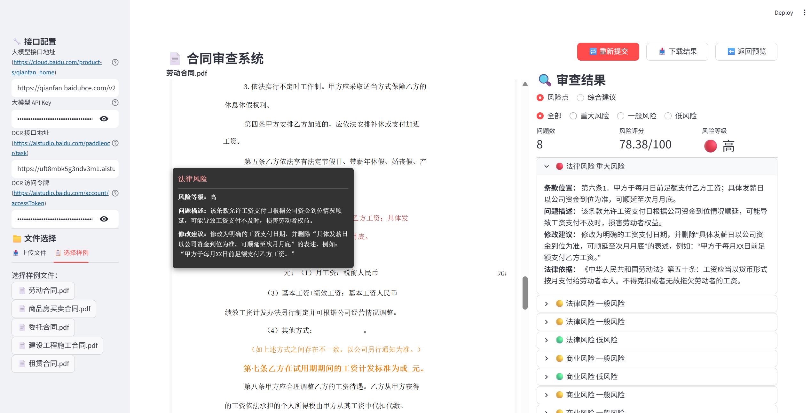

<div align="center">

[English](README.md) | [中文](README_CN.md)

[![AI Studio](https://img.shields.io/badge/AI_Studio-_Online_Demo-1927BA?logo=data:image/png;base64,iVBORw0KGgoAAAANSUhEUgAAAgAAAAIACAMAAADDpiTIAAAABlBMVEU2P+X///+1KuUwAAAHKklEQVR42u3dS5bjOAwEwALvf2fMavZum6IAImI7b2yYSqU+1Zb//gAAAAAAAAAAAAAAAAAAAAAAAAAAAAAAAAAAAAAAAAAAAAAAAAAAAAAAAAAAAAAAAAAAAAAAAAAAAAAAAADKCR/+fzly7rD92yVg69xh8zeLwOa5w+ZvFYHtc4ft3ykB++cOm79PAp6YO2z/Ngl4ZO5l+9+yT4QAvLqS748VF33Ylzdvzpl72f6z53YIGJ6SZdPeNHcIwOycaADdLgCSIgAIgCOAACAAykIAEAAEAAFAABCAT+WQuQVgeBqXhXQIQAAYegowLQBpbg3gZGFyAC6vgBQAMREA2/YfDPxyaDQNyTNz+3Zwn5J4ZG7PB2h0kHhi7plPCImmJwkPzO0RMa3OET0i5uGlzHFze0xcu0vE2Dq3J4U2vEPgSaHbFzPNDQAAAAAAAMBNovdw+cP/ny+uaf7w/+eYADy8kE+F4Offdjn6zZXhAXgiA78G4MNNsmnu1Xr7b3mbOL8T5Ja5bw/A35EC2LiWpzt1y9jRugBy30fLg3NvHPvnuZcC2NsCUXA/aRmA89V07Fwgt37uH8deCmBr6N44pP4UgaUATpdA7v/cMbIB8okliY65/SW5HhJ1ehPmM+8edwXgpbu4R88FayR32Y/P7oZZbOx13/Zr//ZHx27bAPnkFoyewYlbAhD3TvBobr95gaUAtr1EdNx1lgI4OcTTuR3z6+FZMEDRcu9ZCuDgGCdyGxMa4EgBRMvcjrkM7NgBZw5c0TwAUWUhZwRXA2xaya65Xa3jO2qYZ8bu2AD5w38tG5V8aZpoGN6Tz0bOfa9bceyWAciTO0jWyO1Tc5cLwJmF/JfPnXVyu3/slgHIg1n79O2O5fZv+1cHV7sC2HYqmUdHysNzX3sVkMcjUK5Gc+dMs28E5bGtm0V3gloBOP9vgZv+4sYn3RUaYFMCol5uN77g6lUApc8pWs69Zn7snS9Z9Q8G0S0AUTVUUTG3A54R1KSvo/diLAv5fKzynZeN6xogC75u93+AtBTA47OlAFSv6qY/vp3DAjD8iv2ZdFYJwKynMhTK1rInPfzaxW81LnvSgFP9KxrATaCLA3DxHpbFX31ZyNm5XRZyXG5bNkAWfP0rcrsUwOgC6NIAzgBcBiqAWwPgLrAGuGBP6jr2sifdfiJ6QQM4Bbw4AK4B3129ZSFn53ZZyA/GyFty27IBFMDFAXAG8PbyLQv5xULGPRl0K3h2AbwcgCZPhs+LD1zLnjS6AN4NwMU/DVFh7LyhASreTbvqrxdr/J4XT4Swz4FrTS+AGJ7bNbwAYkxuWzZAVljHrJfbjb9wviYXwFO/FJ8Vli4vaICsEMFyBbA3tmtsAUS0zG1c/bj4YwsZH2/+Whd0+1Nb+S7IE2sfPw4RL0XmsR8Nqvz7qFngmPHF34EqjP15AAofAkosZKPC/K6FVoeP02Ehi540NG6AK/4pYP3cLgVwXwHkDQ1QcSGb/uF4WwCmfX8u/+4vgLINcMUlQIfcLgXwXAF0+BGkpQDuuJx7/hwgpu//cWVuO3wxJOz/z8297vgYBwaIO3O7Kn+c194578ltywbIgu8fl+Z2lS+APvnLjnOv8hsgSqxjgwL4Ln9LAezaj98tgPzy7ZcC+GQzxrWxXQpgx370dm6/H7v6jaBoso5dY1swAFlwHWvfBf5pxVa93fCtdx64+1dsgCy4joWvAfPX9VoKYMs6Zse9/8Mlvv7LILlhAfKFFdsSutJXAdFkL3qlADJPrXFcXAC5KYaH586jO9mtAch9S3T0GQJ726ZWAE49kjP3rlDJuetdaL/1zeqZY9c7CRz7s0wCUPxienQBnAuAAtAAlxaAAAxfyBQABSAACkAAFIAAKAABUAACMEkKwL170oh7V8ueNLoAjgTAXWAN4BRwcABcA2oABTA4AApAAyiAwQFQABpAAQwOgALQADMWUgCuEmNyu15fSIY3gFPAiwPgFFADKIDBAVAAGkABCIACmBqAUAAaQAHMDUCMWkgBuMWw3K43F5LhDeAU8OIAuAmkARTA4AAoAA2gAARAAUwNgLvAGkABDA6Au8AaoKOJuV0vLSTDG8Ap4MUBcBNIAyiAwQFQABpAAQwOgALQAApAABTA1AC4C6wBOhqb23V+IRneAE4BLw6Aa0ANoAAGB0ABaAAFMDgACkADKAABUABTA+AusAboKATAQs4trjV+IYcfuJYCcA6gAATAQk69dFkKQANYyLkFcLIBFIDLQAVwawDsSRrAEWBwAJwCagAFMDgACkADKIDBAVAAGkABCIACmBoAzwXWAApgcADsSRrg0iNACoACEADXgAIwdCFTACykALgGFIAfl0kBAAAAAAAAAAAAAAAAAAAAAAAAAAAAAAAAAAAAAAAAAAAAAAAAAAAAAAAAAAAAAAAAAAAAAAAAAAAAAAAAAPBv/gN+IH8U6YveYgAAAABJRU5ErkJggg==&labelColor=white)](https://aistudio.baidu.com/application/detail/104781)
[![AI Studio Blog](https://img.shields.io/badge/AI_Studio-_BLOG-1927BA?logo=data:image/png;base64,iVBORw0KGgoAAAANSUhEUgAAAgAAAAIACAMAAADDpiTIAAAABlBMVEU2P+X///+1KuUwAAAHKklEQVR42u3dS5bjOAwEwALvf2fMavZum6IAImI7b2yYSqU+1Zb//gAAAAAAAAAAAAAAAAAAAAAAAAAAAAAAAAAAAAAAAAAAAAAAAAAAAAAAAAAAAAAAAAAAAAAAAAAAAAAAAADKCR/+fzly7rD92yVg69xh8zeLwOa5w+ZvFYHtc4ft3ykB++cOm79PAp6YO2z/Ngl4ZO5l+9+yT4QAvLqS748VF33Ylzdvzpl72f6z53YIGJ6SZdPeNHcIwOycaADdLgCSIgAIgCOAACAAykIAEAAEAAFAABCAT+WQuQVgeBqXhXQIQAAYegowLQBpbg3gZGFyAC6vgBQAMREA2/YfDPxyaDQNyTNz+3Zwn5J4ZG7PB2h0kHhi7plPCImmJwkPzO0RMa3OET0i5uGlzHFze0xcu0vE2Dq3J4U2vEPgSaHbFzPNDQAAAAAAAMBNovdw+cP/ny+uaf7w/+eYADy8kE+F4Offdjn6zZXhAXgiA78G4MNNsmnu1Xr7b3mbOL8T5Ja5bw/A35EC2LiWpzt1y9jRugBy30fLg3NvHPvnuZcC2NsCUXA/aRmA89V07Fwgt37uH8deCmBr6N44pP4UgaUATpdA7v/cMbIB8okliY65/SW5HhJ1ehPmM+8edwXgpbu4R88FayR32Y/P7oZZbOx13/Zr//ZHx27bAPnkFoyewYlbAhD3TvBobr95gaUAtr1EdNx1lgI4OcTTuR3z6+FZMEDRcu9ZCuDgGCdyGxMa4EgBRMvcjrkM7NgBZw5c0TwAUWUhZwRXA2xaya65Xa3jO2qYZ8bu2AD5w38tG5V8aZpoGN6Tz0bOfa9bceyWAciTO0jWyO1Tc5cLwJmF/JfPnXVyu3/slgHIg1n79O2O5fZv+1cHV7sC2HYqmUdHysNzX3sVkMcjUK5Gc+dMs28E5bGtm0V3gloBOP9vgZv+4sYn3RUaYFMCol5uN77g6lUApc8pWs69Zn7snS9Z9Q8G0S0AUTVUUTG3A54R1KSvo/diLAv5fKzynZeN6xogC75u93+AtBTA47OlAFSv6qY/vp3DAjD8iv2ZdFYJwKynMhTK1rInPfzaxW81LnvSgFP9KxrATaCLA3DxHpbFX31ZyNm5XRZyXG5bNkAWfP0rcrsUwOgC6NIAzgBcBiqAWwPgLrAGuGBP6jr2sifdfiJ6QQM4Bbw4AK4B3129ZSFn53ZZyA/GyFty27IBFMDFAXAG8PbyLQv5xULGPRl0K3h2AbwcgCZPhs+LD1zLnjS6AN4NwMU/DVFh7LyhASreTbvqrxdr/J4XT4Swz4FrTS+AGJ7bNbwAYkxuWzZAVljHrJfbjb9wviYXwFO/FJ8Vli4vaICsEMFyBbA3tmtsAUS0zG1c/bj4YwsZH2/+Whd0+1Nb+S7IE2sfPw4RL0XmsR8Nqvz7qFngmPHF34EqjP15AAofAkosZKPC/K6FVoeP02Ehi540NG6AK/4pYP3cLgVwXwHkDQ1QcSGb/uF4WwCmfX8u/+4vgLINcMUlQIfcLgXwXAF0+BGkpQDuuJx7/hwgpu//cWVuO3wxJOz/z8297vgYBwaIO3O7Kn+c194578ltywbIgu8fl+Z2lS+APvnLjnOv8hsgSqxjgwL4Ln9LAezaj98tgPzy7ZcC+GQzxrWxXQpgx370dm6/H7v6jaBoso5dY1swAFlwHWvfBf5pxVa93fCtdx64+1dsgCy4joWvAfPX9VoKYMs6Zse9/8Mlvv7LILlhAfKFFdsSutJXAdFkL3qlADJPrXFcXAC5KYaH586jO9mtAch9S3T0GQJ726ZWAE49kjP3rlDJuetdaL/1zeqZY9c7CRz7s0wCUPxienQBnAuAAtAAlxaAAAxfyBQABSAACkAAFIAAKAABUAACMEkKwL170oh7V8ueNLoAjgTAXWAN4BRwcABcA2oABTA4AApAAyiAwQFQABpAAQwOgALQADMWUgCuEmNyu15fSIY3gFPAiwPgFFADKIDBAVAAGkABCIACmBqAUAAaQAHMDUCMWkgBuMWw3K43F5LhDeAU8OIAuAmkARTA4AAoAA2gAARAAUwNgLvAGkABDA6Au8AaoKOJuV0vLSTDG8Ap4MUBcBNIAyiAwQFQABpAAQwOgALQAApAABTA1AC4C6wBOhqb23V+IRneAE4BLw6Aa0ANoAAGB0ABaAAFMDgACkADKAABUABTA+AusAboKATAQs4trjV+IYcfuJYCcA6gAATAQk69dFkKQANYyLkFcLIBFIDLQAVwawDsSRrAEWBwAJwCagAFMDgACkADKIDBAVAAGkABCIACmBoAzwXWAApgcADsSRrg0iNACoACEADXgAIwdCFTACykALgGFIAfl0kBAAAAAAAAAAAAAAAAAAAAAAAAAAAAAAAAAAAAAAAAAAAAAAAAAAAAAAAAAAAAAAAAAAAAAAAAAAAAAAAAAPBv/gN+IH8U6YveYgAAAABJRU5ErkJggg==&labelColor=white)](https://aistudio.baidu.com/blog/detail/747544675010117)
[![AI Studio Notebook](https://img.shields.io/badge/AI_Studio-_Notebook-1927BA?logo=data:image/png;base64,iVBORw0KGgoAAAANSUhEUgAAAgAAAAIACAMAAADDpiTIAAAABlBMVEU2P+X///+1KuUwAAAHKklEQVR42u3dS5bjOAwEwALvf2fMavZum6IAImI7b2yYSqU+1Zb//gAAAAAAAAAAAAAAAAAAAAAAAAAAAAAAAAAAAAAAAAAAAAAAAAAAAAAAAAAAAAAAAAAAAAAAAAAAAAAAAADKCR/+fzly7rD92yVg69xh8zeLwOa5w+ZvFYHtc4ft3ykB++cOm79PAp6YO2z/Ngl4ZO5l+9+yT4QAvLqS748VF33Ylzdvzpl72f6z53YIGJ6SZdPeNHcIwOycaADdLgCSIgAIgCOAACAAykIAEAAEAAFAABCAT+WQuQVgeBqXhXQIQAAYegowLQBpbg3gZGFyAC6vgBQAMREA2/YfDPxyaDQNyTNz+3Zwn5J4ZG7PB2h0kHhi7plPCImmJwkPzO0RMa3OET0i5uGlzHFze0xcu0vE2Dq3J4U2vEPgSaHbFzPNDQAAAAAAAMBNovdw+cP/ny+uaf7w/+eYADy8kE+F4Offdjn6zZXhAXgiA78G4MNNsmnu1Xr7b3mbOL8T5Ja5bw/A35EC2LiWpzt1y9jRugBy30fLg3NvHPvnuZcC2NsCUXA/aRmA89V07Fwgt37uH8deCmBr6N44pP4UgaUATpdA7v/cMbIB8okliY65/SW5HhJ1ehPmM+8edwXgpbu4R88FayR32Y/P7oZZbOx13/Zr//ZHx27bAPnkFoyewYlbAhD3TvBobr95gaUAtr1EdNx1lgI4OcTTuR3z6+FZMEDRcu9ZCuDgGCdyGxMa4EgBRMvcjrkM7NgBZw5c0TwAUWUhZwRXA2xaya65Xa3jO2qYZ8bu2AD5w38tG5V8aZpoGN6Tz0bOfa9bceyWAciTO0jWyO1Tc5cLwJmF/JfPnXVyu3/slgHIg1n79O2O5fZv+1cHV7sC2HYqmUdHysNzX3sVkMcjUK5Gc+dMs28E5bGtm0V3gloBOP9vgZv+4sYn3RUaYFMCol5uN77g6lUApc8pWs69Zn7snS9Z9Q8G0S0AUTVUUTG3A54R1KSvo/diLAv5fKzynZeN6xogC75u93+AtBTA47OlAFSv6qY/vp3DAjD8iv2ZdFYJwKynMhTK1rInPfzaxW81LnvSgFP9KxrATaCLA3DxHpbFX31ZyNm5XRZyXG5bNkAWfP0rcrsUwOgC6NIAzgBcBiqAWwPgLrAGuGBP6jr2sifdfiJ6QQM4Bbw4AK4B3129ZSFn53ZZyA/GyFty27IBFMDFAXAG8PbyLQv5xULGPRl0K3h2AbwcgCZPhs+LD1zLnjS6AN4NwMU/DVFh7LyhASreTbvqrxdr/J4XT4Swz4FrTS+AGJ7bNbwAYkxuWzZAVljHrJfbjb9wviYXwFO/FJ8Vli4vaICsEMFyBbA3tmtsAUS0zG1c/bj4YwsZH2/+Whd0+1Nb+S7IE2sfPw4RL0XmsR8Nqvz7qFngmPHF34EqjP15AAofAkosZKPC/K6FVoeP02Ehi540NG6AK/4pYP3cLgVwXwHkDQ1QcSGb/uF4WwCmfX8u/+4vgLINcMUlQIfcLgXwXAF0+BGkpQDuuJx7/hwgpu//cWVuO3wxJOz/z8297vgYBwaIO3O7Kn+c194578ltywbIgu8fl+Z2lS+APvnLjnOv8hsgSqxjgwL4Ln9LAezaj98tgPzy7ZcC+GQzxrWxXQpgx370dm6/H7v6jaBoso5dY1swAFlwHWvfBf5pxVa93fCtdx64+1dsgCy4joWvAfPX9VoKYMs6Zse9/8Mlvv7LILlhAfKFFdsSutJXAdFkL3qlADJPrXFcXAC5KYaH586jO9mtAch9S3T0GQJ726ZWAE49kjP3rlDJuetdaL/1zeqZY9c7CRz7s0wCUPxienQBnAuAAtAAlxaAAAxfyBQABSAACkAAFIAAKAABUAACMEkKwL170oh7V8ueNLoAjgTAXWAN4BRwcABcA2oABTA4AApAAyiAwQFQABpAAQwOgALQADMWUgCuEmNyu15fSIY3gFPAiwPgFFADKIDBAVAAGkABCIACmBqAUAAaQAHMDUCMWkgBuMWw3K43F5LhDeAU8OIAuAmkARTA4AAoAA2gAARAAUwNgLvAGkABDA6Au8AaoKOJuV0vLSTDG8Ap4MUBcBNIAyiAwQFQABpAAQwOgALQAApAABTA1AC4C6wBOhqb23V+IRneAE4BLw6Aa0ANoAAGB0ABaAAFMDgACkADKAABUABTA+AusAboKATAQs4trjV+IYcfuJYCcA6gAATAQk69dFkKQANYyLkFcLIBFIDLQAVwawDsSRrAEWBwAJwCagAFMDgACkADKIDBAVAAGkABCIACmBoAzwXWAApgcADsSRrg0iNACoACEADXgAIwdCFTACykALgGFIAfl0kBAAAAAAAAAAAAAAAAAAAAAAAAAAAAAAAAAAAAAAAAAAAAAAAAAAAAAAAAAAAAAAAAAAAAAAAAAAAAAAAAAPBv/gN+IH8U6YveYgAAAABJRU5ErkJggg==&labelColor=white)](https://aistudio.baidu.com/projectdetail/9779934)

</div>


# PactGuard-ERNIE-PP

PactGuard-ERNIE-PP is an intelligent contract review tool: upload PDF/scanned documents/images → complete layout restoration and text structure extraction using PP-StructureV3/local parsing → call ERNIE 4.5 to identify high-risk, missing, and non-standard clauses and generate modification suggestions with source text positioning, ultimately outputting rich text reports. This repository provides an end-to-end workflow application from "upload contract → automatic parsing → risk identification → suggestion generation → export report", including Streamlit Web UI, pluggable MCP document parsing service, and extensible LLM capability configuration.



## Core Capabilities

- **Multi-format Parsing**: Focus on PDF / scanned documents / images, combining local parsing with online OCR parsing, and implementing layout reconstruction in `ui_ocr_utils.py` to preserve paragraph, table, and coordinate information.
- **End-to-End Workflow**: `ui_workflow.py` + `contract_workflow.py` split "parsing → risk analysis → suggestion generation → result rendering" into four observable stages.
- **AI Risk Insights**: Output risk levels, scores, matched contract clauses, and itemized revision suggestions from both legal and business dimensions, with source text positions marked in reports.
- **History Retention and Reuse**: Analysis results and intermediate products are automatically written to `contract_analysis_results/`, `jsons/`, `mds/` for secondary verification or playback.
- **One-Click Startup Experience**: Run `python -m streamlit run ui_workflow.py` to automatically detect/launch `mcp_service.py` and start the Streamlit UI.
- **Customizable LLM/OCR**: Switch LLM API Base, API Key, and OCR interfaces at any time through environment variables, enabling flexible cloud/local combinations.

## System Architecture Overview

- **UI Layer**: `ui_workflow.py` is based on Streamlit, responsible for file upload, sample selection, real-time preview, and result visualization (including highlighted HTML, risk panels, suggestion lists).
- **Workflow Engine**: `ContractWorkflow` defines the ordered steps of parsing, analysis, and report generation; `ui_workflow_processor.py` decouples UI events from workflow execution.
- **Document Processing Service (MCP)**: `mcp_service.py` provides local parsing, layout analysis, and OCR capabilities, decoupled from UI through HTTP health checks.
- **Rendering and Utilities**: Modules like `ui_rendering.py`, `ui_utils.py`, `ui_ocr_utils.py` encapsulate caching, sample processing, UI beautification, and online parsing utility functions.
- **Asset Directories**:
  - `contracts/`: Sample contracts
  - `contract_analysis_results/`: Structured JSON
  - `jsons/`, `mds/`: Intermediate data and Markdown summaries
  - `pics/`: Interface screenshots (including `demo.png`)

## Directory Structure

```
pp-contract/
├── contract_workflow.py          # Core workflow
├── ui_workflow.py                # Streamlit UI
├── ui_workflow_processor.py      # UI-triggered scheduler
├── ui_rendering.py               # Risk cards/HTML highlighting
├── ui_utils.py                   # Caching, samples, session management
├── ui_ocr_utils.py               # OCR/online parsing utilities
├── mcp_service.py                # Document parsing/OCR backend
├── contract_analysis_results/    # Historical results
├── contracts/                    # Demo contracts
├── pics/demo.png                 # README screenshot
└── requirements.txt              # Dependencies
```

## Workflow Stages

1. **📄 Document Parsing**  
   - Call MCP service to complete layout parsing, OCR, and structured extraction; supports cache hits and online OCR (`ui_ocr_utils.call_online_parse_api`).
2. **🔍 Risk Analysis**  
   - `ContractWorkflow` internally calls LLM to perform multi-dimensional analysis of contract semantics, merging historical cache with real-time detection.
3. **💡 Suggestion Generation**  
   - Output risk levels, problem locations, modification suggestions, and signing recommendations, written to `contract_analysis_results/contract_analysis_*.json`.
4. **📊 Result Display**  
   - `ui_rendering.generate_html_layout` is responsible for generating highlighted HTML; the right panel simultaneously renders structured risk cards, suggestions, and source text comparison.

## Environment Setup

- Python 3.10+ (recommended to align with `requirements.txt`)
- Installed `pip`, `virtualenv`, or Conda
- Accessible LLM / OCR API

```bash
git clone https://github.com/tjujingzong/PactGuard-ERNIE-PP
cd PactGuard-ERNIE-PP
python -m venv .venv
.venv\Scripts\activate  # macOS/Linux: source .venv/bin/activate
pip install -r requirements.txt
```

## Startup

```bash
python -m streamlit run ui_workflow.py
```

The system will automatically:
1. Check if `mcp_service.py` is already running at `http://localhost:7001`;
2. If not running, automatically start the MCP service in the background and wait for health checks;
3. Start the Streamlit UI (default port 8501, you can specify a different port using `--server.port` when starting).

The browser will automatically open or you can access the displayed address (usually `http://localhost:8501`).

## Usage Guide

1. **Upload/Select File**: Support drag-and-drop upload or select samples from `contracts/`, the system will instantly generate text preview.
2. **Configuration Options**: Configure APIs in the sidebar.
3. **Start Analysis**: Click "Start Analysis", the interface will display a four-stage progress bar; if analysis fails, check the error message for the corresponding stage.
4. **View Results**: The left side displays the highlighted contract, the right side contains:
   - Risk cards
   - LLM suggestion source text
   - Signing recommendations/summary
5. **Download/Reuse**: All results are written in JSON/Markdown format to `contract_analysis_results/`, uploading the same file again will directly read the latest cache.

## Development and Debugging

- **Logging and Health Checks**: `mcp_service.py` provides a `/health` endpoint; the UI side will automatically detect and start the MCP service for easy fault tolerance.
- **Samples and Caching**: `ui_utils.initialize_session_state` controls cache keys; during debugging, you can delete `contract_analysis_results/` to ensure a fresh run.
- **UI Customization**: `ui_workflow.py` contains extensive CSS, supporting custom layouts, dark themes, etc.; `ui_rendering.py` is the unified export for highlighting and risk cards.
- **Extending LLM**: When integrating new models/pipelines in `ContractWorkflow`, just follow the unified input/output format to decouple from the UI.

## FAQ

- **MCP Service Cannot Start**: Confirm port 7001 is free; manually execute `python mcp_service.py` to view error logs.
- **OCR Failure**: Check `OCR_API_URL` and `OCR_API_TOKEN`; you can also temporarily disable online OCR and use only local parsing.
- **LLM Call Timeout**: Set up a proxy for `requests` or change networks; if necessary, reduce uploaded file size.
- **Cache Hit But Interface Not Refreshing**: Click "Force Re-parse" or clear the corresponding file in `contract_analysis_results/`.

---

For contributions or secondary development, please feel free to submit PRs / Issues, or replicate more features in the UI shown in the README screenshot.
